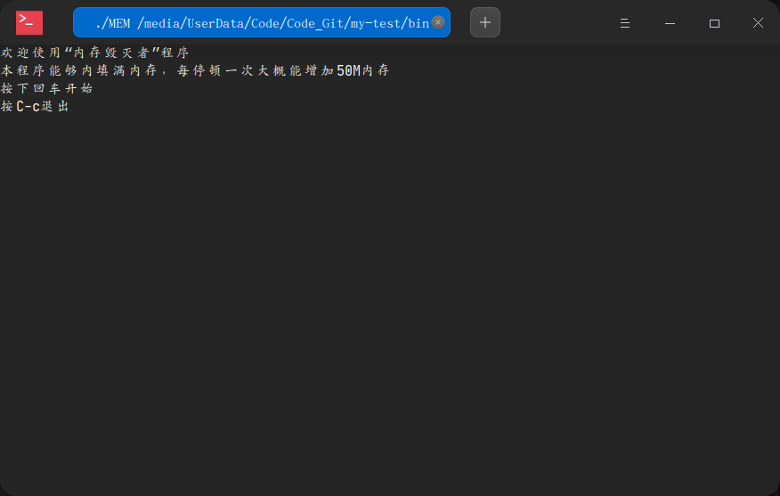
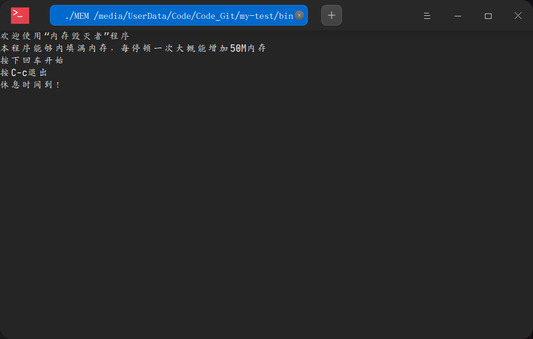
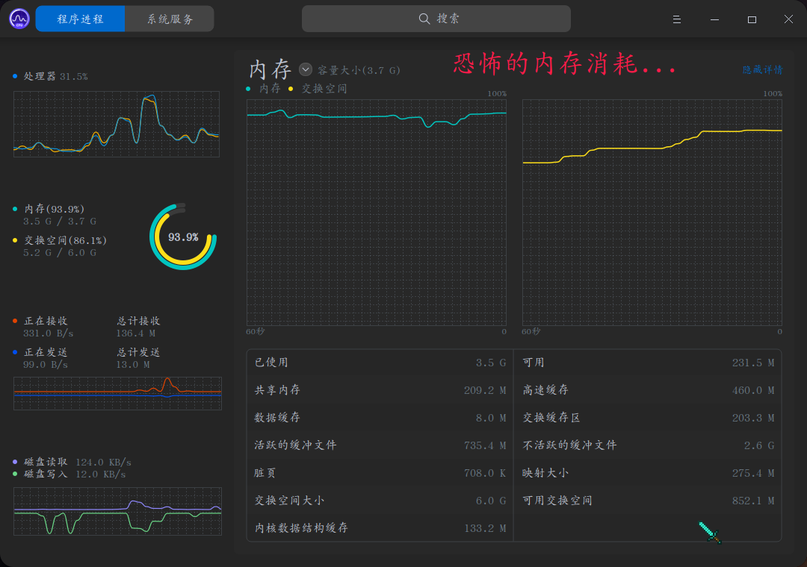
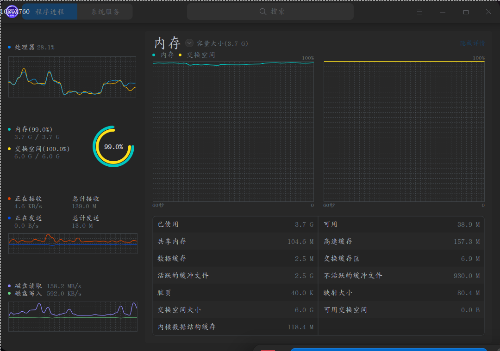
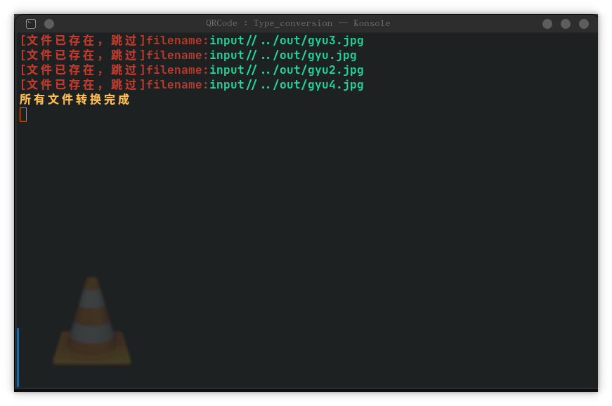

# my-test

- 这是我的一个测试文件仓库
- 全部存放c语言测试文件
- 大都只适用于Linux系统

> 我英文渣，文件名都是乱取的 :|

## 文件的功能

|            文件名          |                      测试的功能                      |
|:--------------------------:|:----------------------------------------------------:|
|         \*ASCII.c          |         打印ASCII码所对应的字符（因为懒得查）        |
|          auto-do.c         |              可以按照格式批量执行一些命令            |
|          \*boom.c          |    无聊写的，用来爆破数学题，效率贼低，不如直接算    |
|           build.c          |这个文件用于自动编译文件到bin/，且可执行文件在主目录下|
|           clock.c          |      用于测试Linux的时钟api函数setitimer函数功能     |
|          \*do.c            |                 用于编译并执行c源文件                |
|         download.c         |   从指定文件获取url下载文件，或在文件中指定url下载   |
|       \*filelist.c         |             查看指定目录下的文件和文件夹             |
|        \*install.c         |一条接着以掉执行指定文件的命令（格式固定）方便重装系统|
|        \*gettime.c         |                       获取时间                       |
|          \*gtk.c           |             在Linux下使用gtk做gui的测试              |
|          \*MEM.c           |           吞噬你的内存（我电脑差点被作死了）         |
|          menupro.c         |           测试菜单（可选择）功能时的初版程序         |
|           mkfile.c         | 在认识dd和/dev/null前做的创建文件工具，有进度条(好用)|
|          \*pid.c           |       Linux下使用系统默认库使用多个进程的测试        |
|     \*Progress\_bar.c      |       无聊写的进度条测试工具，可能会在后面用到       |
|          readfile.c        |        不断地查看指定文件的内容（适用于小文件）      |
|\*Reverse\_progress\_bar.c  |                类似于一条反方向的进度条              |
|            RSA.c           |                RSA飞对称加密算法测试                 |
|           socket.c         |                    套接字测试文件                    |
|    \*Text\_effects.c       |      测试Linux下printf加上\033的文字显示效果测试     |
|     Type\_conversion.c     | Linux下调用ffmpeg来对媒体文件进行格式转换(懒得打命令)|

> 注：文件名前带有'\*'的为不再改动（不维护）的文件

- 这些测试大都没有什么用... :|

## 文件运行的效果

- MEM.c
  - 程序界面
    
    
  - 内存填充效果
    
    
    
- Type_conversion.c
  - 使用多个进程同时调用ffmpge以快速地转换文件（不用打命令半天）
  - 命令格式

    ```sh
    Type_conversion -d 文件夹 -t 目标格式后缀
    ```

  - 程序界面
    - 初始界面
      

    - 完成后
      

    - 完成后再执行
      
