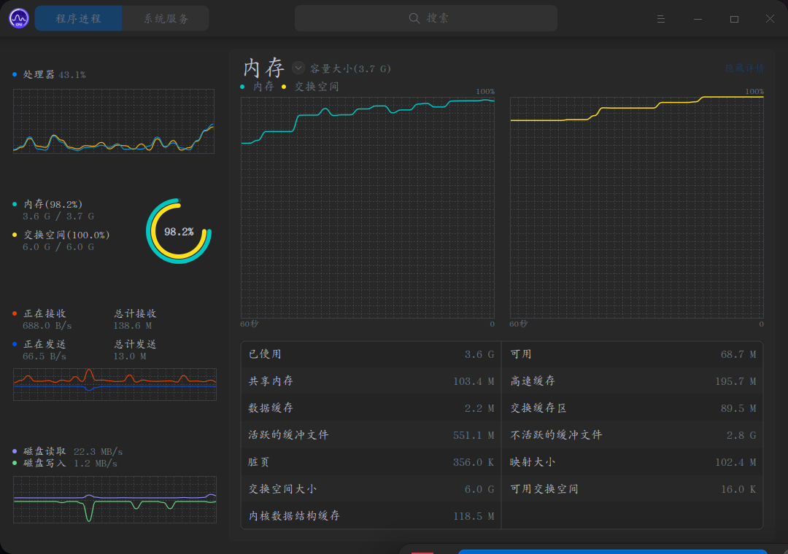

# my-test

- 这是我的一个测试文件仓库
- 全部存放c语言测试文件
- 适用于Linux系统

> 我英文渣，文件名都是乱取的 :|

## 文件的功能

|           文件名         |                      测试的功能                      |
|:------------------------:|:----------------------------------------------------:|
|          ASCII.c         |         打印ASCII码所对应的字符（因为懒得查）        |
|           boom.c         |    无聊写的，用来爆破数学题，效率贼低，不如直接算    |
|           do.c           |                 用于编译并执行c源文件                |
|        download.c        |   从指定文件获取url下载文件，或在文件中指定url下载   |
|         gettime.c        |                       获取时间                       |
|           gtk.c          |             在Linux下使用gtk做gui的测试              |
|           MEN.c          |           吞噬你的内存（我电脑差点被作死了）         |
|          mkfile.c        | 在认识dd和/dev/null前做的创建文件工具，有进度条(好用)|
|      Progress\_bar.c     |       无聊写的进度条测试工具，可能会在后面用到       |
|           pid.c          |       Linux下使用系统默认库使用多个进程的测试        |
|         readfile.c       |        不断地查看指定文件的内容（适用于小文件）      |
| Reverse\_progress\_bar.c |                类似于一条反方向的进度条              |
|           RSA.c          |                RSA飞对称加密算法测试                 |
|     Text\_effects.c      |      测试Linux下printf加上\033的文字显示效果测试     |
|    Type\_conversion.c    | Linux下调用ffmpeg来对媒体文件进行格式转换(懒得打字)  |

- 这些测试基本上都没有什么用... :|

## 文件的效果

- MEN.c

